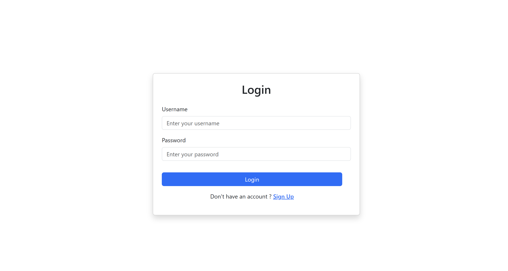
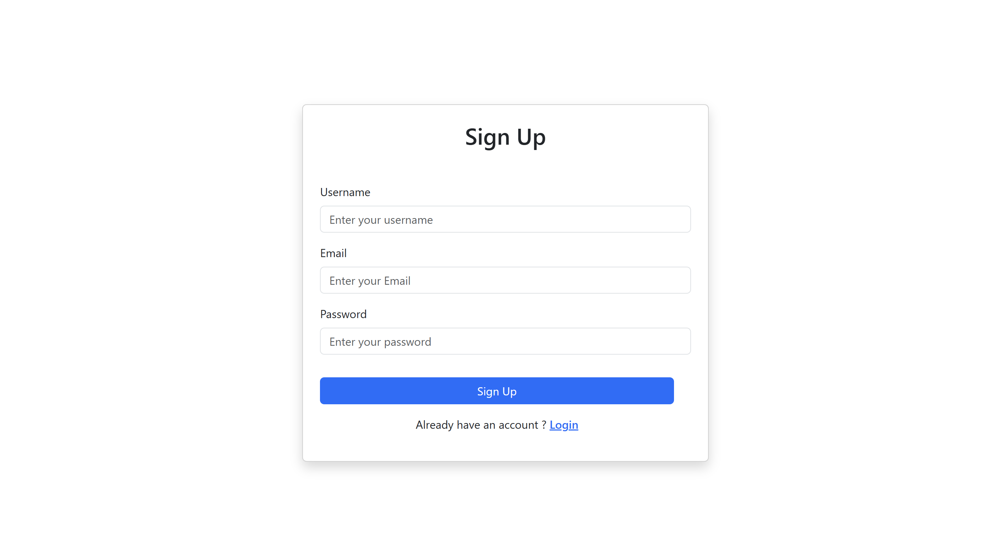
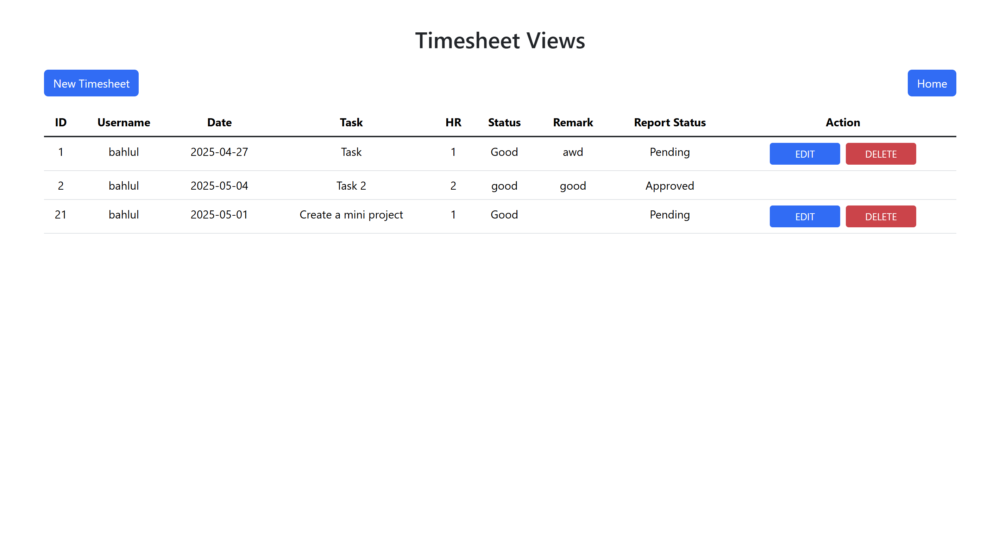
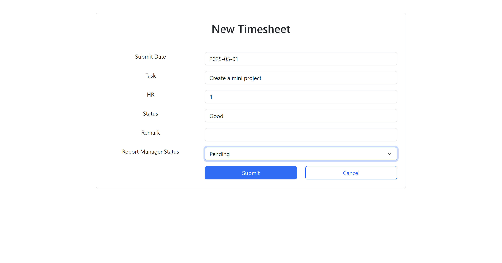
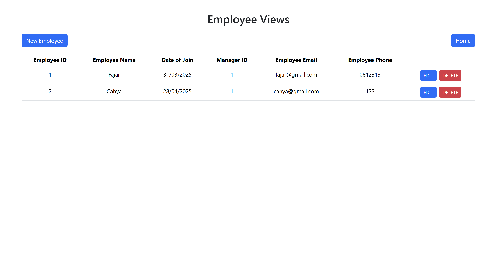
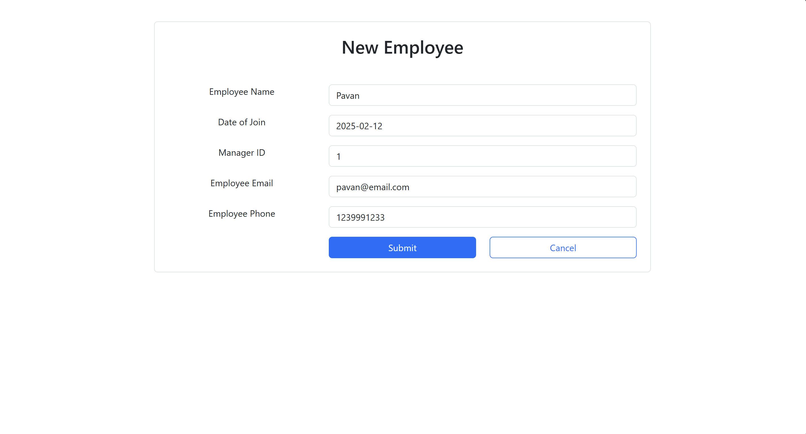
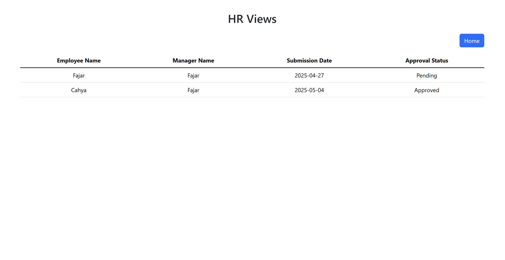

# Auth Project – Frontend

This is the **React** frontend for the `java-project-be`, built using **Vite**. It interacts with a **Spring Boot REST API** for authentication and authorization features.

---

## Setup

### 1. Clone the project

```bash
git clone https://github.com/juniarc/midas-mini-project-fe.git
cd midas-mini-project-fe-main
```

### 2. Install dependencies

```bash
npm install
```

### 3. Start the dev server

```bash
npm run dev
```

### Features

## Authentication

### Login

- Users can log in using their registered **username** and **password**.
- Authentication is secured to ensure user data protection and jwt token.



### Register

- New users can register by providing their:
  - **Name**
  - **Email**
  - **Username**
  - **Password**
- Passwords are securely encoded for safety.



---

## Timesheet View

This section allows users to manage their timesheets.



### Features:

- Create new timesheet entries
- Edit existing timesheets
- Delete timesheets



### Fields for New / Edit Timesheet:

- **Task**: Description of the assigned task
- **Submit Date**: Date the timesheet is submitted
- **HR**: Manager's ID
- **Status**: Task status from the user's side
- **Remark**: Notes from the user
- **Report Manager Status**: Status updated by the manager

---

## Employee View

Manage employee data easily from this view.



### Features:

- Add new employee
- Edit employee details
- Delete employee



### Fields for New / Edit Employee:

- **Employee Name**: Full name of the employee
- **Date of Join**: The date the employee joined
- **Manager ID**: ID of the employee’s manager
- **Employee Email**: Email address
- **Employee Phone**: Phone number

---

## HR View

- Displays the progress of timesheets submitted by all employees.
- Helps HR and managers monitor and evaluate employee performance.



---
